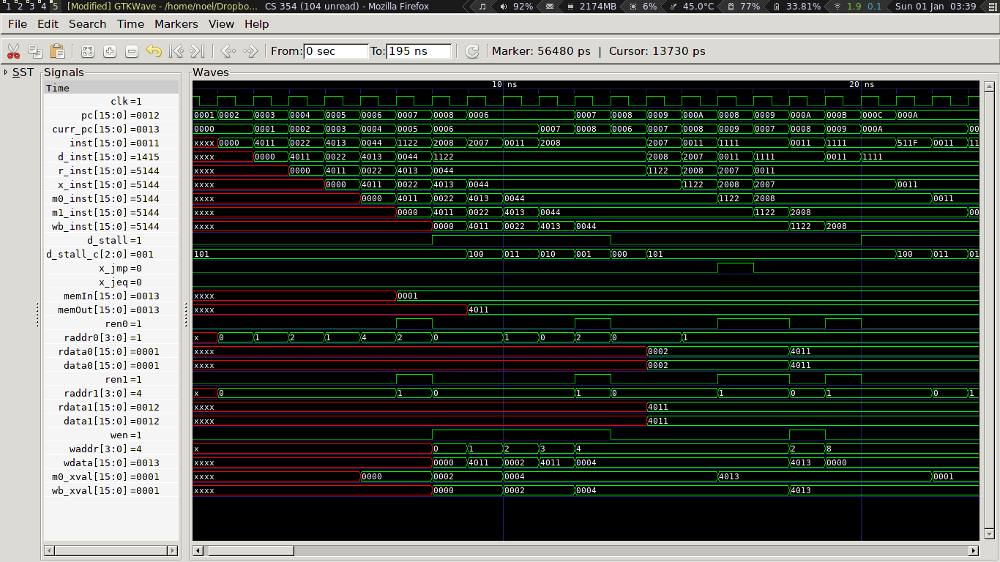

# Processor

A comprehensive implementation of a 16-bit RISC pipelined processor with branch prediction and instruction caching using Verilog.

The pipeline is implemented with a 7-stage pipeline - Fetch, Decode, Register, Execute, Mem0 (fetch), Mem1, and Write Back.

The pipeline handles hazards using forwarding, stalling, and caching.

The branch predictor uses a 2-bit saturating counter and simple jump table to simulate predictions.

Below is a visual demonstration (using gtkwave) of the pipeline in action

##Instruction Set

| Encoding         | Instruction | Description									 |
|:----------------:|:-----------:|:---------------------------------------------:|
| 0000iiiiiiiitttt | mov i,t     | regs[t] = i; pc += 1;				  		 |
| 0001aaaabbbbtttt | add a,b,t   | regs[t] = regs[a] + regs[b]; pc += 1;  		 |
| 0010jjjjjjjjjjjj | jmp j       | pc = j;								  		 |
| 0011000000000000 | halt        | stop fetching instructions			  		 |
| 0100iiiiiiiitttt | ld i,t      | regs[t] = mem[i]; pc += 1;			  		 |
| 0101aaaabbbbtttt | ldr a,b,t   | regs[t] = mem[regs[a]+regs[b]]; pc += 1;		 |
| 0110aaaabbbbtttt | jeq a,b,t   | if (regs[a] == regs[b]) pc += d; else pc += 1;|
| 0111aaaassssssss | st s,a      | mem[s] = regs[a]; pc += 1;					 |

## To compile and run
~~~~~~~~~~
    make & make run
~~~~~~
### To test
~~~~~~~
    make test
